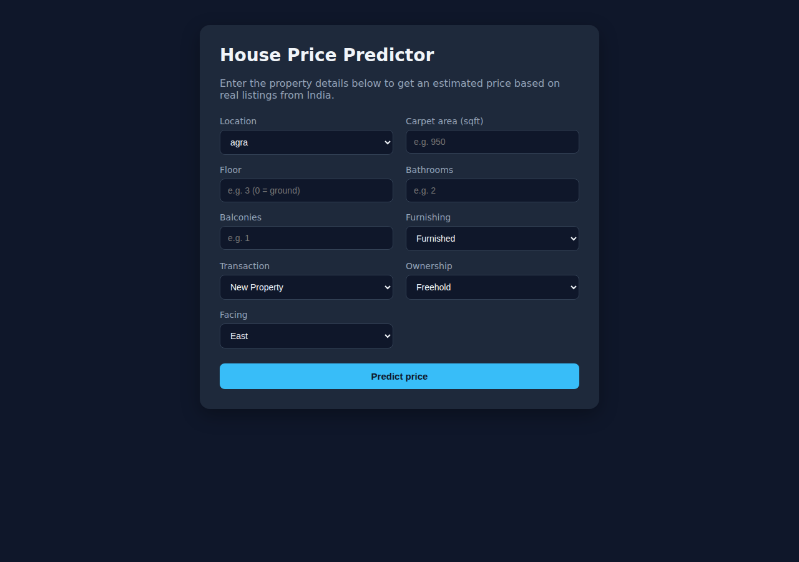
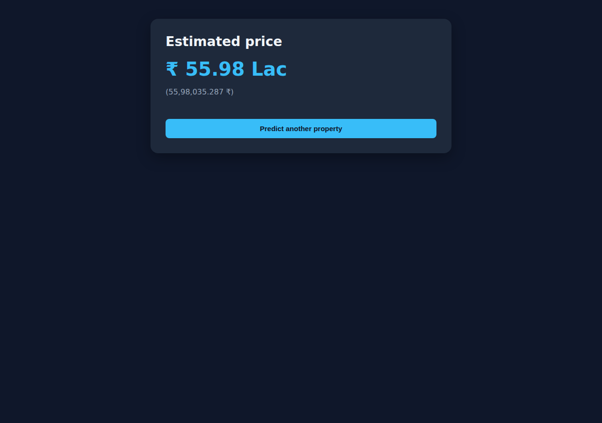

# House Price Prediction — End-to-End ML Web App

A complete machine-learning product: a Jupyter notebook that cleans ~187K Indian real-estate
listings and trains a regression model, a FastAPI backend that serves it, and a React frontend
where anyone can enter property details and get an instant price estimate.

## Overview

1. **`notebooks/`** — cleans the raw Kaggle CSV, explores it, trains and compares two regression
   models, and exports the winning pipeline as `house_price.pkl`.
2. **`backend/`** — a FastAPI service that loads the pipeline once at startup and exposes
   `GET /health` and `POST /predict`.
3. **`frontend/`** — a React + TypeScript + Vite app where a user fills a form and sees the
   predicted price.

## Architecture

```
┌─────────────┐        POST /predict        ┌──────────────┐       model.predict()      ┌────────────────────┐
│   Browser   │ ───────────────────────────▶ │   FastAPI     │ ─────────────────────────▶ │ house_price.pkl     │
│  (React UI) │ ◀─────────────────────────── │   backend     │ ◀───────────────────────── │ (sklearn Pipeline)  │
└─────────────┘      { predicted_price }     └──────────────┘        prediction           └────────────────────┘
                                                                                                     ▲
                                                                                                     │ exported by
                                                                                                     │
                                                                                          ┌─────────────────────┐
                                                                                          │ house_price_model    │
                                                                                          │  .ipynb (training)   │
                                                                                          └─────────────────────┘
```

## Tech stack

- **Data / ML:** Python, pandas, numpy, scikit-learn, matplotlib, seaborn, joblib
- **Backend:** FastAPI, Pydantic v2, pydantic-settings, uvicorn, pytest, httpx
- **Frontend:** React 19, TypeScript, Vite, react-router-dom
- **Dataset:** [House Price by Juhi Bhojani](https://www.kaggle.com/datasets/juhibhojani/house-price) on Kaggle

## Project structure

```
house-price-app/
├── notebooks/
│   ├── house_price_model.ipynb
│   └── data/                     # put house_prices.csv here (gitignored)
├── backend/
│   ├── app/
│   │   ├── main.py               # FastAPI app, CORS, model loaded at startup
│   │   ├── api/routes/prediction.py
│   │   ├── core/config.py
│   │   ├── schemas/prediction.py
│   │   ├── services/preprocessing.py
│   │   ├── services/inference.py
│   │   └── utils/logging_config.py
│   ├── models/house_price.pkl    # copied from the notebook
│   ├── tests/test_prediction.py
│   ├── requirements.txt
│   ├── .env.example
│   └── Dockerfile
├── frontend/
│   ├── src/
│   │   ├── api/predictionClient.ts
│   │   ├── components/PredictionForm.tsx
│   │   ├── pages/HomePage.tsx | ResultPage.tsx | NotFoundPage.tsx
│   │   ├── types/prediction.ts
│   │   └── App.tsx
│   ├── public/locations.json     # copied from the notebook
│   └── .env.example
└── README.md
```

## Dataset

- **Source:** https://www.kaggle.com/datasets/juhibhojani/house-price
- **File:** `house_prices.csv`, ~187,000 rows of real property listings from India.

### Download it

**Option A — manual:** open the link above, click *Download*, unzip, and place
`house_prices.csv` in `notebooks/data/`.

**Option B — Kaggle CLI (recommended):**

```bash
pip install kaggle
# Get your API token: Kaggle → Settings → API → "Create New Token"
# Place kaggle.json in ~/.kaggle/ (macOS/Linux) or C:\Users\<you>\.kaggle\ (Windows)
kaggle datasets download -d juhibhojani/house-price -p notebooks/data --unzip
```

## Running the notebook

```bash
python -m venv .venv
source .venv/bin/activate        # Windows: .venv\Scripts\activate
pip install jupyter pandas numpy scikit-learn matplotlib seaborn joblib
jupyter notebook notebooks/house_price_model.ipynb
```

Run all cells top-to-bottom. At the end you'll get `house_price.pkl` and `locations.json` in
`notebooks/`. Copy them:

```bash
cp notebooks/house_price.pkl backend/models/house_price.pkl
cp notebooks/locations.json  frontend/public/locations.json
```

## Running the backend

```bash
cd backend
python -m venv .venv
source .venv/bin/activate        # Windows: .venv\Scripts\activate
pip install -r requirements.txt
cp .env.example .env
uvicorn app.main:app --reload
```

Open http://localhost:8000/docs for the interactive Swagger UI, or run the tests:

```bash
pytest
```

## Running the frontend

```bash
cd frontend
npm install
cp .env.example .env
npm run dev
```

Open http://localhost:5173.

## Environment variables

**Backend (`backend/.env`)**

| Variable | Default | Description |
|---|---|---|
| `MODEL_PATH` | `models/house_price.pkl` | Path to the exported pipeline |
| `LOCATIONS_PATH` | `models/locations.json` | Path to the known-locations list |
| `CORS_ORIGINS` | `http://localhost:5173` | Comma-separated allowed origins |
| `LOG_LEVEL` | `INFO` | Logging verbosity |

**Frontend (`frontend/.env`)**

| Variable | Default | Description |
|---|---|---|
| `VITE_API_BASE_URL` | `http://localhost:8000` | Base URL of the FastAPI backend |

## API reference

### `GET /health`

```bash
curl http://localhost:8000/health
```

```json
{ "status": "ok" }
```

### `POST /predict`

```bash
curl -X POST http://localhost:8000/predict \
  -H "Content-Type: application/json" \
  -d '{
    "location": "Wakad",
    "carpet_area_sqft": 950,
    "floor_num": 3,
    "bathroom": 2,
    "balcony": 1,
    "furnishing": "Semi-Furnished",
    "transaction": "Resale",
    "ownership": "Freehold",
    "facing": "East"
  }'
```

```json
{ "predicted_price": 5615360.26 }
```

## Model metrics

Trained on the real `house_prices.csv` dataset (174,471 rows after cleaning; 80/20 train/test
split, `random_state=42`). Numbers below are exactly what Section 5 of the notebook printed:

| Model | MAE | RMSE | R² |
|---|---|---|---|
| Linear Regression | 4,528,921 | 8,393,175 | 0.6227 |
| **Random Forest (winner)** | **1,351,110** | **5,367,105** | **0.8457** |

5-fold cross-validation on the winning model (negative MAE, `n_estimators=60` for speed):
per-fold MAE ≈ `[1,835,325 / 7,675,688 / 2,322,620 / 6,899,215 / 3,690,767]`, mean CV MAE ≈
**4,484,723**. The spread across folds is expected: this dataset mixes very different price
tiers (e.g. tier-1 metros vs. smaller cities) and a 5-way split occasionally puts a harder mix
of listings in one fold's test set, which is also why the full test-set MAE above (using the
complete 200-tree model, not the lighter 60-tree CV clone) is noticeably lower than the CV mean.

Random Forest was chosen because it captures the non-linear interactions between location,
area, furnishing, etc. far better than a plain linear model on this messy, high-cardinality
data. `RandomForestRegressor` uses `n_estimators=200, max_depth=14` — the depth cap keeps
training time practical and reduces overfitting on the noisy, text-parsed listings; it also
means the model occasionally ignores a lower-importance feature (e.g. floor number) for a
specific input if none of the 200 trees happened to split on it along that particular path —
expected behavior for tree ensembles, not a bug.

## Verifying everything works

The full pipeline was run end-to-end and verified directly: the notebook was executed top to
bottom (Kernel → Restart & Run All) producing the metrics above and `house_price.pkl`, the
FastAPI backend was booted for real with `uvicorn` and hit with `curl` on `/health` and
`/predict`, `pytest` was run against the live model, and the React frontend was installed,
built (`npm run build`), and exercised through a real browser session (form fill → submit →
result page) to produce the screenshots below.

You can re-verify the same way on your machine with one script:

```bash
bash scripts/verify_project.sh
```

It installs backend deps and runs `pytest`, boots the real `uvicorn` server and hits
`/health` + `/predict` with curl, then installs frontend deps and runs `npm run build`. It
prints a clear PASS/FAIL summary.

## Screenshots

Home page (form):



Result page (prediction):




## License

For educational use as part of a student project.
